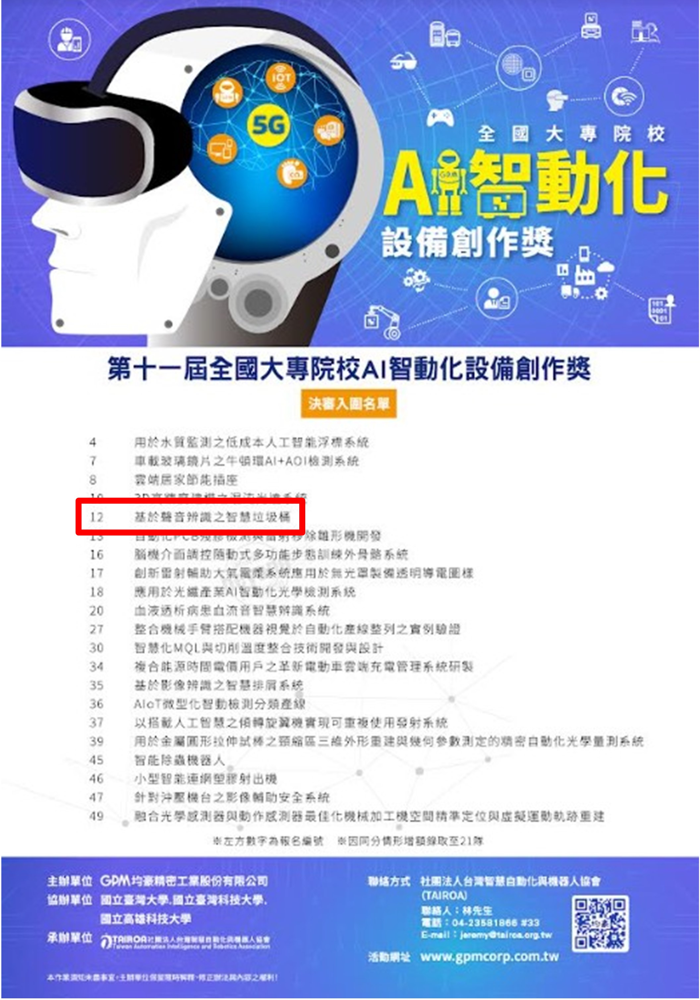
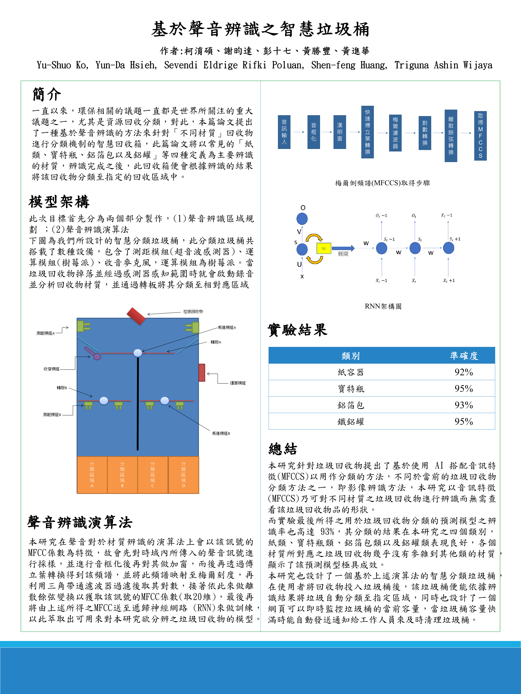
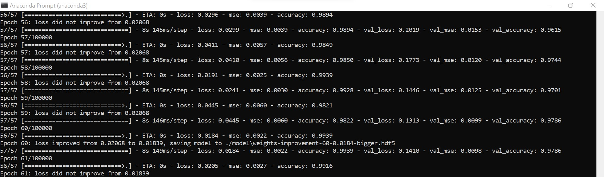
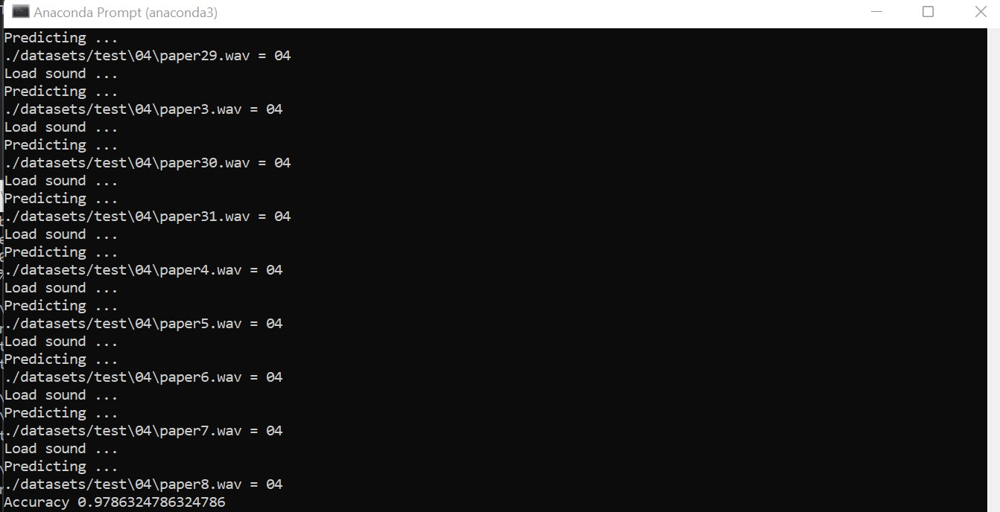

# Project info

This program was developed for a smart basket that runs on a Raspberry Pi. It is built to participate in the GPM's 11th National College AI Intelligent Automation Equipment Creation Award competition. Among 67 participants, we rank in the **top 21**. These are the details for the final announcement for all the projects that have been accepted **(our team is listed under project number 12)**.

	 

The following is a poster that we provided for this project. 

	 

  

# Descriptions

**The program was developed under the Raspberry Pi environment.**

Install the dependencies \
`python -m pip install --user -r .\requirements\requirements.txt` 

You will also need to install another dependency in the `.\requirements/installing_pyaudio.txt` file.

Train the model \
`python .\codes\train\train.py`
 
In addition to training the model, melfrequency features will also be extracted into the pickle and saved for later use. In order to avoid re-extraction of features when retraining the model, you may wish to comment off line 54 of the `train.py` file. The process of extracting the features will take time.

	 

The folder model contains a saved model. The following command can be executed to test the model with the available testing data.

Test the model \
`python .\codes\test\test.py`

	 

[![Watch the video]](https://github.com/spoluan/rpi-smart-wastebasket/blob/final/video/b916f5e5-2caf-4fd7-bd3c-38fa56654bee.mp4)

# Datasets

Data collection (adjust the class that you want to collect inside soundcollection.py) \
`python ./soundcollection.py`

